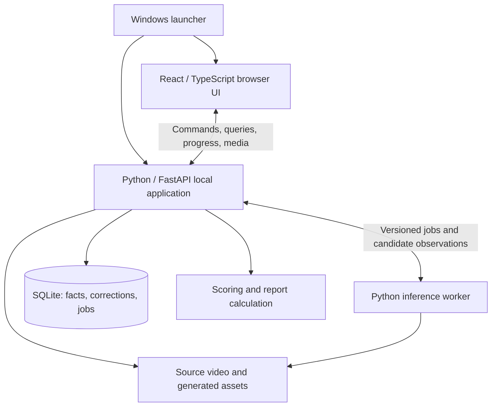

# V1 design

Status: consolidated design for final review, based on the accepted interview decisions. The architecture and implementation details below make those decisions concrete; model performance and footage support remain unvalidated.

The [README](../README.md) defines V1 scope and validation requirements. [CONTEXT.md](../CONTEXT.md) defines domain vocabulary. Decisions here refine that scope unless explicitly identified as a change.

## Agreed product and operating constraints

- Prioritize serve, return, and third-shot net-or-out error rates in the dashboard and review workflow. Each statistic opens its supporting rallies. The other first-report capabilities in the README remain in scope.
- Use a browser dashboard on the same Windows machine that processes the video. Access from another device is outside the current design scope.
- Allow automatic observations to contribute to statistics without individual operator approval when they satisfy acceptance rules validated in the pilot. Keep review status visible and preserve unknown attributes. Numerical thresholds remain pilot decisions.
- Start with existing models. The operator is willing to annotate examples; benchmark performance will determine whether to revisit targeted training or fine-tuning. Custom-model development is not currently committed, and saving corrections does not trigger training.
- Use Python/FastAPI for the backend and a separate Python inference worker, with a React/TypeScript browser UI and SQLite metadata storage. Use uv for the Python environment and lockfile, Ruff for linting and formatting, and ty for type checking. Enforce explicit annotations and strict type rules through the [quality gates](quality.md).

## Agreed review and processing behavior

- Review individual facts within a rally. Bulk acceptance applies only to the visible proposals selected by the operator; confirming one attribute does not confirm the others.
- Measure the 15-minute setup/review target per hour of footage without enforcing a cutoff. Show elapsed operator time and unresolved issues affecting statistics. The operator may continue reviewing or finish with an incomplete report whose exclusions are explicit. Exceeding the target is a failure against that benchmark, even when the report is otherwise useful.
- Preserve human corrections across reprocessing. Transfer a correction only when its corresponding event is identified reliably. Event splits introduced by reprocessing require review; ambiguous correspondence must not silently move a correction to another event. See [correction reconciliation](adr/0001-preserve-corrections-through-reprocessing.md).
- Reference the original video rather than copying it on import. Store annotations and generated assets in a managed match workspace. Detect missing or changed source files, and allow relinking to the same footage. Moving a workspace to another machine also requires moving its footage.
- Allow review of completed rallies while the remainder of the match processes. Publish consistent rally results for review, preserve subsequent corrections, and clearly identify the report as provisional during processing.
- Propose game boundaries automatically and allow the operator to correct them. Setup identifies players, teams, and match format. Uncertain game boundaries or opening service states become review items and do not invalidate independently supported shot facts.
- During reprocessing, keep the previous consistent interpretation active while a conflicting replacement awaits reconciliation. Mark the pending conflict visibly. On initial processing, facts without a consistent supported interpretation remain unresolved.
- Show eligible versus detected attempts and unresolved observation gaps. When the number of missing attempts is unknown, do not claim complete-match coverage. Error rates may still use attempts with known outcomes and visibly qualified coverage.
- Store other and unknown shot types separately: other is an observed shot outside the named categories, while unknown means insufficient evidence to classify it.
- Permit adding missed shots or rallies, removing false detections, adjusting boundaries, and splitting or merging events. Place structural edits in an advanced menu, preserve their history, and preview affected labels and statistics before applying them.

## Agreed UI and application lifecycle

- Use a focused review workspace: rally queue on the left, large video in the center, editable facts and review reasons on the right, and a shot timeline below. Provide keyboard shortcuts, frame stepping, playback speed, and undo.
- Keep reporting on a separate screen. Opening supporting rallies from a statistic preserves its filters.
- A Windows launcher starts the local application and opens the browser. Closing the browser does not stop processing. Explicit controls pause processing or quit the application.
- Offer resumption from saved work after a crash or restart. Overnight processing requires the Windows machine to remain awake.
- Retain persistent correction history and undo. Make an automatic metadata backup before reprocessing; generated assets remain rebuildable. Backing up the original source video is the operator's responsibility.
- Provide a guided one-time setup that checks dependencies and downloads required model weights, followed by the launcher for everyday use. A self-contained installer is not required for V1. Validate final dependency versions and GPU compatibility on the Windows processing machine.

## Architecture

Build one local application with deep modules, one browser UI, and a separate inference process. Build React/TypeScript into static files served by FastAPI. Keep one active inference worker initially, and serialize SQLite writes through the local application while allowing concurrent review reads. The [backend ADR](adr/0002-python-coordinator-and-inference-worker.md) records the choice of Python over a Rust coordinator.



The launcher owns application lifecycle independently of browser tabs. Persist jobs and checkpoints; a background HTTP task alone does not provide crash recovery. Keep expensive model loading inside the inference worker. Publish consistent analysis revisions through short database transactions, and preserve human edits independently of replacement predictions.

Use indexed original-video timestamps and source frames as evidence anchors. If playback requires a browser-compatible proxy, retain and verify its mapping to the original. Exact frame stepping must resolve indexed source frames rather than assume that changing the browser playback time by an average frame duration selects the intended source frame.

### Module responsibilities

| Module | Interface presented to callers | Behavior kept inside the module |
| --- | --- | --- |
| Match workspace | Import, inspect source availability, relink, back up, reopen | Source identity, managed asset paths, metadata backups, and recoverable workspace state |
| Video evidence | Play a source interval, inspect an exact frame, locate an annotation in footage | Source indexing, optional playback proxy, timestamp mapping, and bounded decoding |
| Processing | Start, inspect progress, pause, resume, request reprocessing | Durable work state, worker lifecycle, checkpoints, model configuration, and retry handling |
| Annotation and reconciliation | Inspect rally facts, confirm, correct, preview structural edits, apply, undo | Original predictions, human history, event correspondence, conflict detection, and activation of consistent interpretations |
| Scoring | Inspect rally-boundary state and effects of a proposed correction | Side-out rules, independent evidence, uncertain states, dependent-state propagation, and confirmed-checkpoint conflicts |
| Reporting | Query a metric with supporting evidence and exclusions; export a consistent report | Population and eligibility rules, per-attribute provenance, coverage, and links back to contributing rallies |
| Review | Request prioritized rally items and resolve selected proposals | Grouping related issues by rally, report-impact priorities, unresolved reasons, and operator-time accounting |

The worker produces versioned candidate observations. It does not own human corrections or directly activate a new report interpretation. The local application reconciles candidates with current human work before publication, including a revision check so a late worker result cannot overwrite an edit made during processing.

Treat all facts as independently supported attributes, including hitter, rally role, contact mode, shot type, immediate outcome, and rally outcome. A known role or outcome remains usable when unrelated shot-type classification is unknown. Structural edits trigger validation and dependent-state recalculation; removing a false event preserves its history rather than erasing the evidence of the correction.

Build review and reporting on the same effective facts. Reporting must return counts and the exact supporting event identifiers together, so selecting a metric cannot open a differently computed evidence population. Pending reprocessing conflicts remain visible alongside the still-active interpretation. A report assembled during ongoing processing must identify its revision and analyzed extent.

### Local communication and lifecycle

Bind the application to loopback only. Serve UI, commands, progress, and registered media from the same origin. Mutations use validated typed request models with an expected revision; stale edits receive a conflict response and retain the operator's unsaved proposal. Validate origin and host on browser requests and keep media access scoped to registered workspace assets. The launcher supplies a local session credential without introducing a user-account workflow.

Use ordinary request/response calls for edits and queries, and a reconnectable progress stream for stage/job notifications. Reconnecting obtains a fresh persisted snapshot before consuming new updates. Never infer job completion from a closed browser connection.

The worker receives immutable jobs with run, stage, source, configuration, and expected-input revision identifiers. Use a versioned structured control protocol carrying file references and small results; do not serialize raw video frames through it. Candidate artifacts are written to temporary paths and finalized before publication. Validate the worker's output at the coordinator, which is the sole metadata writer.

Job states: queued, running, pause requested, paused, completed, failed, and interrupted. Pause stops scheduling new work and checkpoints the current bounded work unit when possible. Quit stops the supervisor and its owned worker after saving acknowledged progress. A killed worker can require recomputing the uncommitted unit, but never loses confirmed edits or completed publications. Detect stale running jobs after restart and offer explicit resumption. Resume validates source identity, stage inputs, and model/configuration version before reusing a checkpoint.

Worker failures do not terminate review. Show a stage-specific error, preserve completed results, and offer retry from the last valid checkpoint. A duplicate result for an already committed work unit must be harmless. A changed upstream stage invalidates only dependent candidates; a new run never silently changes the currently active reviewed interpretation.

### Persistence and identity

Use a local managed workspace per match. Keep its metadata database, backup snapshots, source manifest, generated playback assets, frame indexes, run artifacts, and exports together. Reference the original video by path and content identity; do not copy it during import. Compute a full content digest outside the UI request path, record file metadata as a fast change signal, and do not finalize reusable evidence anchors until identity is established. Recheck identity on relinking or suspected modification. Relinking accepts matching source content; a different encode requires a separate import or a future explicit timestamp migration, not silent reuse.

| Record | Essential content and invariant |
| --- | --- |
| Source video | ID, URL, path, content digest, stream metadata, source timestamp origin/time base, frame index; evidence remains tied to this source |
| Match / game / player / team | Stable IDs, operator-confirmed identities and membership, game order and format; server number never serves as a player ID |
| Processing run / work unit | Model and weight identity, configuration, input revisions, stage, progress, checkpoint, status, artifact references |
| Rally / shot / interpretation | Stable logical identity with versioned event structure, source intervals or contact anchors, candidate-to-active correspondence, gaps and structural lineage |
| Attribute observation | Attribute, known value or explicit unknown, evidence anchors, reason, model confidence when available, run/version provenance |
| Human decision | Confirmation, correction, explicit unknown, or structural change; prior/new values, evidence, time, expected revision, and undo relationship |
| Score evidence / checkpoint | Rally-boundary score facts, serving facts, source timing, confirmation status and conflicts; individual facts can remain unknown |
| Review item | Rally grouping, affected facts/metrics, review reason, priority, candidate revision, and disposition |
| Report revision | Selected active interpretations, calculation/annotation-guide version, analyzed extent, pending conflicts, exact contributing/excluded event IDs |

Represent unknowns as unknown values with reasons, not as zero, false, or successful shots. Keep value certainty distinct from review status: an operator can confirm that an attribute remains unknown. Validate untrusted model/API payloads into typed domain records before computing statistics. Broad dictionaries of dynamic values are not the interface for domain logic.

Human decisions are durable history with current effective state derived from predictions plus decisions. Undo records a new decision restoring the prior state; it does not erase history. Retain original predictions and model identities even when superseded. Structural edits preserve lineage, and automatic splits always enter review. Ambiguous merges or other correspondence changes involving human work also enter review.

Publish an affected set of rallies, dependent score states, and active report revision atomically. This set can include multiple rallies for a split/merge or score correction. Recompute only the dependent portion through the next confirmed score checkpoint; a conflicting checkpoint creates a review item and leaves the disputed derived state unresolved. Independently supported shot facts survive that conflict. For model reprocessing, keep the previous active interpretation until a replacement is consistent, with a visible pending-conflict marker. A human correction updates its known facts immediately while disputed dependent score fields remain unknown; it does not silently retain the value the operator just corrected.

Use short SQLite transactions and foreign-key constraints. Take a database-aware metadata snapshot before reprocessing or schema migration; restore only with the worker stopped, validate the restored schema/source identity, and retain the pre-restore workspace for recovery. Large model outputs stay in files referenced by metadata. A failed backup blocks the reprocessing start and explains how to retry. Do not prune reusable annotations or source video as automatic cache cleanup.

### Processing pipeline

| Stage | Output | Important uncertainty or recovery behavior |
| --- | --- | --- |
| Import and index | Validated source manifest, frame/time index, optional browser playback proxy | A proxy's timeline must map back to the source; exact inspection uses source frames |
| Broadcast segmentation | Camera segments, live-play candidates, replay/transition spans, proposed game/rally intervals | Exclude replays from event counts; uncertain live/replay classification requires review |
| Identity and geometry | Track-to-player proposals, camera-specific court mapping, coarse regions | Re-establish mapping after camera changes; uncertain identity or geometry stays unknown |
| Shot observations | Contact candidates, partial shot sequences, independent attribute proposals | Do not invent contacts across an occlusion or assign sequence roles past an unresolved gap |
| Outcome and scoring evidence | Immediate net/out/in/other-fault facts, rally outcome, overlay/audio observations, rule-checked states | Account for delayed overlays; no evidence source is universally authoritative |
| Reconciliation and publication | Consistent active facts, review items, coverage and provisional report revision | Human edits take precedence; late results cannot overwrite edits; conflicting replacements await review |

These are logical stages, not a promise that a single pretrained model covers each one. Start by evaluating available models on representative segments; choose combinations only after measuring failure modes and resource use. Batch frames/windows under a bounded memory budget and avoid loading a whole match into RAM. Preserve temporal context at work-unit boundaries and deduplicate overlap by event identity before publication.

Do not wait for every attribute before publishing a useful rally: known role/outcome facts can support a rate while shot type remains unknown. The initial UI can use manually created reference annotations before automatic stages exist. Automatic extraction of extra facts from replays remains deferred; review can seek to replay footage as supporting evidence.

## UI design

Use a restrained analysis workspace with neutral surfaces, readable numbers, one primary action per context, and text labels alongside uncertainty colors. Follow the system light/dark appearance. Large desktop layouts prioritize video size; narrower windows move the queue above the video and the fact editor below it. Every action remains reachable by keyboard with visible focus, and shortcuts do not fire inside editable fields.

| Screen | Main content | Primary action and important states |
| --- | --- | --- |
| Match library / import | Existing workspaces with last state, local video selection, source URL, source validation | Import or resume; missing file and failed validation have direct recovery actions |
| Setup | Four player identities and teams, match/game format, initial service evidence, landmark overlay | Confirm setup and process; show elapsed operator time; partial unknown facts remain explicit |
| Processing | Stage progress, analyzed source extent, saved checkpoint, elapsed processing time, queue availability | Open completed rallies or pause; show measured resource use without an invented ETA |
| Review | Rally queue left, video center, facts/reasons right, shot timeline below | Confirm/correct selected facts, leave unknown, and undo; retain report filters when navigating |
| Report | Serve/return/third-shot errors first; player/team breakdowns, rally outcomes, shot counts, coverage and gaps | Open numerator, denominator, or excluded evidence; export the visible report revision |

Setup proposes game boundaries and permits correction rather than requiring manual marking of the entire match. Record best-of format and per-game target where known, without inferring the serving player from server number. When footage does not establish an opening state, retain unknowns and queue the uncertainty; this does not block unrelated shot review.

### Review interaction

Each queue entry shows game/rally position, source time, affected metric, unresolved fact count, and a concise reason. Rank issues by consequence: structural/live-replay conflicts and identity/scoring errors affecting many observations; then role/immediate-outcome ambiguities for the primary error rates; then remaining report labels. Within a priority group, use source order for predictable navigation. Uncertainty alone is not a calibrated estimate of report impact. Keep all rallies inspectable outside the priority queue, and include a separate audit filter for apparently confident automatic output.

The selected rally opens with a short context lead-in and its event timeline. A fact row shows the effective value, automatic proposal, review status, evidence reason, and local actions. Confirming one row does not confirm the other rows. Bulk acceptance visibly enumerates the selected proposals. Leaving a fact unknown persists the decision and removes repeated requests unless new evidence or a structural change makes it relevant again.

Use Space for playback, dedicated previous/next-source-frame controls, a speed selector, previous/next-rally navigation, and an undo shortcut. Frame stepping may display an exact still while playback is paused. Replay evidence opens in a separate clearly labeled interval, without adding attempts. An advanced structural-edit preview lists inserted/removed/split/merged events, invalidated roles, and affected score/report results before application.

Display operator setup/review time persistently without a hard stop. Record timed sessions and explicit pauses; flag long inactivity for operator confirmation rather than silently discarding difficult review time. Separate benchmark annotation sessions from routine review sessions. At or beyond the target, the operator may continue or finish with the current incomplete report; the benchmark retains the overrun.

### Reports and exports

For each serve/return/third-shot rate, the numerator is observed immediate net/out failures and the denominator is attempts with known role and immediate outcome. Other faults are separate; a third shot that lands in and loses later is not an immediate net/out error. Player/team views additionally require the relevant attribution. Unknown shot type or contact mode alone cannot exclude an otherwise eligible attempt. A zero denominator displays unavailable.

Show error count / eligible attempts and percentage together, followed by eligible / detected attempts, exclusions by missing requirement, and observation gaps. Unknown-role attempts cannot be assigned to a role-specific detected total; show them separately. When a gap or unknown role prevents establishing a complete role population, do not label detected-attempt coverage as complete-match coverage. Attribute-based exclusion reasons may overlap; also display a distinct excluded-event total so users cannot accidentally add overlapping categories.

Separate automatic, operator-confirmed, and operator-corrected provenance without treating review status as certainty. The report identifies unprocessed footage and pending reprocessing conflicts. Clicking any count opens exactly its evidence population at the report revision; if processing advances meanwhile, offer an explicit refresh rather than silently changing that population.

CSV exports contain metric IDs, dimensions, numerator/denominator, coverage/exclusion counts, analyzed extent, and report revision. JSON exports additionally preserve structured annotations, unknown reasons, human history, source evidence anchors, model/configuration identity, pending conflicts, and schema/annotation-guide versions. An unknown missing-attempt count remains null/unavailable in exports. Corrected and automatic-only evaluation exports remain distinguishable.

## Implementation plan and validation

The numerical quality thresholds and selected models are deliberately pilot decisions, as agreed in the README. They are not silently assumed design defaults.

| Milestone | Deliverable | Exit evidence |
| --- | --- | --- |
| 0. Engineering foundation | uv lock, strict Ruff/ty gates, CI; then minimal application, typed contracts and SQLite migrations | Local checks pass; first implementation adds meaningful automated tests and CI must reject zero collected tests |
| 1. Footage and annotation contract | Inspect the provisional broadcast family; annotation guide with examples and edge cases; separate held-out match selected | Source completeness and difficult segments documented; held-out identity and guide version frozen |
| 2. Manual review foundation | Import/index, frame evidence, rally/shot creation, independent facts, structural edits, scoring corrections, persistence, first reports | A manually annotated segment survives close/reopen/undo and every reported count opens its exact evidence |
| 3. Minimal automatic pilot | Existing-model experiments and one resumable processing path feeding the same review workflow | Windows RTX 5080 measurements; per-category error/coverage and setup/review time; explicit numerical acceptance thresholds set after this pilot |
| 4. Full-match workflow | Camera/replay handling, game boundaries, progressive publication, reprocessing reconciliation, backups and exports | Crash/resume, split conflicts, stale edit rejection, and known/unknown reporting pass scenario tests |
| 5. Held-out evaluation | Separate match with at least one complete manually checked game excluded from tuning | Automatic and corrected results evaluated against frozen references and post-pilot thresholds; real operator time measured |

Evaluate rally/contact detection with one-to-one matching and predeclared timestamp tolerances so duplicates, misses, and boundary shifts are counted explicitly. Score shot type, role, contact mode, attribution, and immediate outcome independently, with per-category confusion and abstention/coverage results. Evaluate source-to-frame accuracy, replay false counting, rally-boundary serving/score state, and error-rate numerator/denominator correctness. Include full-game reference annotation so apparently confident omissions are measured, not only reviewed candidates.

Record model/weight/configuration identity, annotation-guide version, CPU/GPU memory peaks, processing throughput, stage failures, and operator setup/review time. Separate automatic output from corrected output and benchmark preparation time from routine operation. Pin acceptance thresholds after the pilot and before expansion; evaluate held-out footage without tuning against it. A missed time target requires explicit scope/footage/model reconsideration, never hidden exclusions or a relaxed target.

Automated scenario checks must cover side-out scoring and its opening exception; unknown denominator behavior; late overlays and checkpoint conflicts; correction during processing; split/merge review; idempotent retries; restoration of a metadata backup; changed/missing footage; source/proxy timestamp mapping; and exact report-to-evidence population consistency. Run ordinary CPU tests on Windows and Linux; run hardware-specific benchmarks on the actual processing machine. See [quality checks](quality.md) for the enforced tooling and the distinction between existing checks and future application tests.

## Decision tree and remaining empirical gates

```text
V1 evidence-linked match analysis
├── Same-machine operation → browser UI → launcher + independent worker lifecycle
├── Primary error report → independent facts → explicit eligibility, coverage and gaps
├── Focused review → structural edits + undo → versioned corrections and reconciliation
├── Concurrent processing/review → consistent publication → retained active interpretation
├── Existing-model start → operator annotation → pilot before training decisions
├── Python/FastAPI → uv + Ruff + ty → local and CI quality gates
└── Referenced source video → managed workspace → identity checks + metadata recovery
```

The behavioral and technology decisions from Q1–Q19 are recorded. This document supplies the concrete implementation design for shared review. Remaining empirical gates are supported-footage validation, annotation boundary examples, model and GPU compatibility, operating resource limits, and numerical pilot thresholds. No local video or reference annotation assets were present during repository inspection. The visual preview uses illustrative data and does not demonstrate model capability.

## Documentation sources

Documentation checked through Context7 and official sources:

- [FastAPI background-task caveats](https://fastapi.tiangolo.com/tutorial/background-tasks/#caveat) and [process memory](https://fastapi.tiangolo.com/deployment/concepts/#memory-per-process) support separating heavy inference from request handling.
- [SQLite WAL](https://sqlite.org/wal.html) supports concurrent reading with a single writer on the same machine. Keep transactions short and verify the bundled SQLite runtime includes current WAL fixes when choosing versions.
- [SQLite online backup](https://sqlite.org/backup.html) provides consistent metadata snapshots; copying an open database file alone is not the proposed backup mechanism.
- [React client-only application builds](https://react.dev/learn/build-a-react-app-from-scratch) and [FastAPI static files](https://fastapi.tiangolo.com/tutorial/static-files/) support serving built UI assets without a separate frontend server at runtime.
- [FFmpeg timestamp options](https://ffmpeg.org/ffmpeg.html#Advanced-options) describe timestamp and frame-rate transformations that require explicit source mapping.
